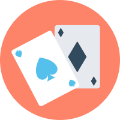

# Poker-Pro

Proyecto asignatura de programación sobre la creación de un poker

# UT4-TE2: Objetos y clases

### TAREA EVALUABLE



## Objetivo

Simular el comportamiento de una **partida de cartas de poker** modalidad **Texas Holdem** utilizando técnicas de programación orientada a objetos.

## Propuesta de módulos

Propuesta de módulos y clases por módulo:

```
├── test_poker.py
├── game.py
│   └── Game
├── cards.py
│   ├── Card
│   ├── Deck
│   └── Hand
└── roles.py
    ├── Dealer
    └── Player
```

### Game 🎲

Debe disponer de la siguiente función:

```python
def get_winner(
    players: list[Player],
    common_cards: list[Card],
    private_cards: list[list[Card]],
) -> tuple[Player | None, Hand]:
```

> 💡 Esta función debe retornar el jugador ganador y la mano ganadora. En caso de empate, el jugador será valor `None` pero la mano ganadora sí tendrá un valor.

### Dealer 🎩

| Datos     | Responsabilidades                  |
| --------- | ---------------------------------- |
| Mazo      | Destapar cartas comunitarias       |
| Jugadores | Dar cartas a los jugadores         |
|           | Pedir la mejor mano a cada jugador |
|           | Dictaminar la mejor mano           |

### Player 🙅‍♀️

| Datos  | Responsabilidades                        |
| ------ | ---------------------------------------- |
| Nombre | Recibir 2 cartas privadas                |
|        | Recibir 5 cartas comunicatorias          |
|        | Encontrar su mejor combinación de cartas |

- Se debe poder construir un objecto `Player` pasando el nombre del jugador. **Ejemplos**: `Player('Player 1'), Player('Player 2')`
- El objeto `Player` debe contener un atributo `name` con el nombre del jugador.

### Card 🃏

| Datos              | Responsabilidades                    |
| ------------------ | ------------------------------------ |
| Número de la carta | Saber si una carta es menor que otra |
| Palo de la carta   | Representar una carta                |

Se debe poder construir un objeto `Card` desde una cadena de texto. **Ejemplos**: `Card('Q♠'), Card('7♣'), Card('A♠')`

### Hand 🤙

| Datos            | Responsabilidades                   |
| ---------------- | ----------------------------------- |
| 5 cartas         | Descubrir la categoría de la mano   |
| Palo de la carta | Saber si una mano es mayor que otra |

- Se debe implementar el método `__contains__()` para determinar si una `Card` pertenece a una `Hand`.
- El objeto `Hand` debe contener un atributo `cat` que identifique la categoría de la mano así como un atributo `cat_rank` que almacene el "ranking" de su categoría: en la mayoría de casos será la carta más alta, pero no siempre. **Ejemplos**:

| `hand.cat`             | Explicación       | `hand.cat_rank` | Explicación                                   |
| ---------------------- | ----------------- | --------------- | --------------------------------------------- |
| `Hand.HIGH_CARD`       | Carta más alta    | `'J'`           | Carta más alta                                |
| `Hand.ONE_PAIR`        | Pareja            | `'5'`           | Carta más alta                                |
| `Hand.TWO_PAIR`        | Dobles parejas    | `('10', '7')`   | Tupla con cartas más altas (de mayor a menor) |
| `Hand.THREE_OF_A_KIND` | Trío              | `'K'`           | Carta más alta                                |
| `Hand.STRAIGHT`        | Escalera          | `'9'`           | Carta más alta                                |
| `Hand.FLUSH`           | Color             | `'Q'`           | Carta más alta                                |
| `Hand.FULL_HOUSE`      | Pareja + Trío     | `('3', 'J')`    | Tupla con carta del trío y carta de la pareja |
| `Hand.FOUR_OF_A_KIND`  | Poker             | `'Q'`           | Carta más alta                                |
| `Hand.STRAIGHT_FLUSH`  | Escalera de color | `'7'`           | Carta más alta                                |

> ⚠️ Aclaraciones de la escalera: Si hay un AS en la escalera, la única posibilidad es que sea la carta más alta en la escalera `A-K-Q-J-10`.

### Deck 🗃️

| Datos     | Responsabilidades     |
| --------- | --------------------- |
| 52 cartas | Dar cartas aleatorias |

> 💡 OPCIONAL

## Módulo helpers

El fichero [helpers.py](./helpers.py) contiene funciones de apoyo al desarrollo del proyecto.

La más importante es: `combinations(values, n)` que genera todas las combinaciones posibles de `values` con tamaño `n`:

```python
>>> list(helpers.combinations((1, 2, 3, 4, 5), n=3))
[(1, 2, 3),
 (1, 2, 4),
 (1, 2, 5),
 (1, 3, 4),
 (1, 3, 5),
 (1, 4, 5),
 (2, 3, 4),
 (2, 3, 5),
 (2, 4, 5),
 (3, 4, 5)]
```

Dos apuntes importantes:

- Lo que le pasamos es un **iterable** con lo que se podría usar una lista de objetos `Card`.
- El parámetro `n` debe pasarse por nombre.

## Comprobación

- Puedes descargar aquí el [fichero de tests](/Archivos_Poker/test_poker.py) para pytest.
- La calificación de la tarea estará en función del número de tests superados y de la calidad del código escrito.

## Referencias

- [Anatomía de una carta de poker](https://bit.ly/45KP9jp)
- [Lista de posibles manos ganadoras](https://en.wikipedia.org/wiki/List_of_poker_hands)
- [Calculadora online de mano ganadora](https://www.pokerlistings.com/which-hand-wins-calculator)
